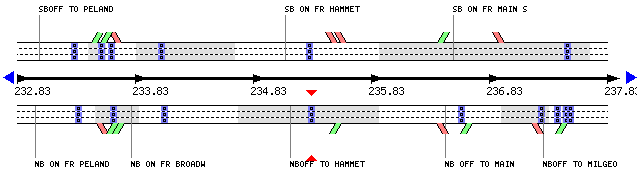

# PeMS

## 单检测器实验
- 数据来源：VDS 1005210 - Hammett Rd
  - ID：1005210
  - 名字：Hammett Rd
  - freeway：SR99-N, District 10, Stanislaus County
  - 路宽：36 ft（ft英寸，1ft = 0.3048m）
  - 车道数：3
  - 车道宽：12 ft
  - 限速：70 mph（mph英里每小时， 1mph = 1.6093km/h）
  - 地势：平坦
  - 经纬度：Lng=121.133332，Lat=37.746753
  - Postmile：CA PM=24.272，Abs PM=235.33
  - Length：1.192
  